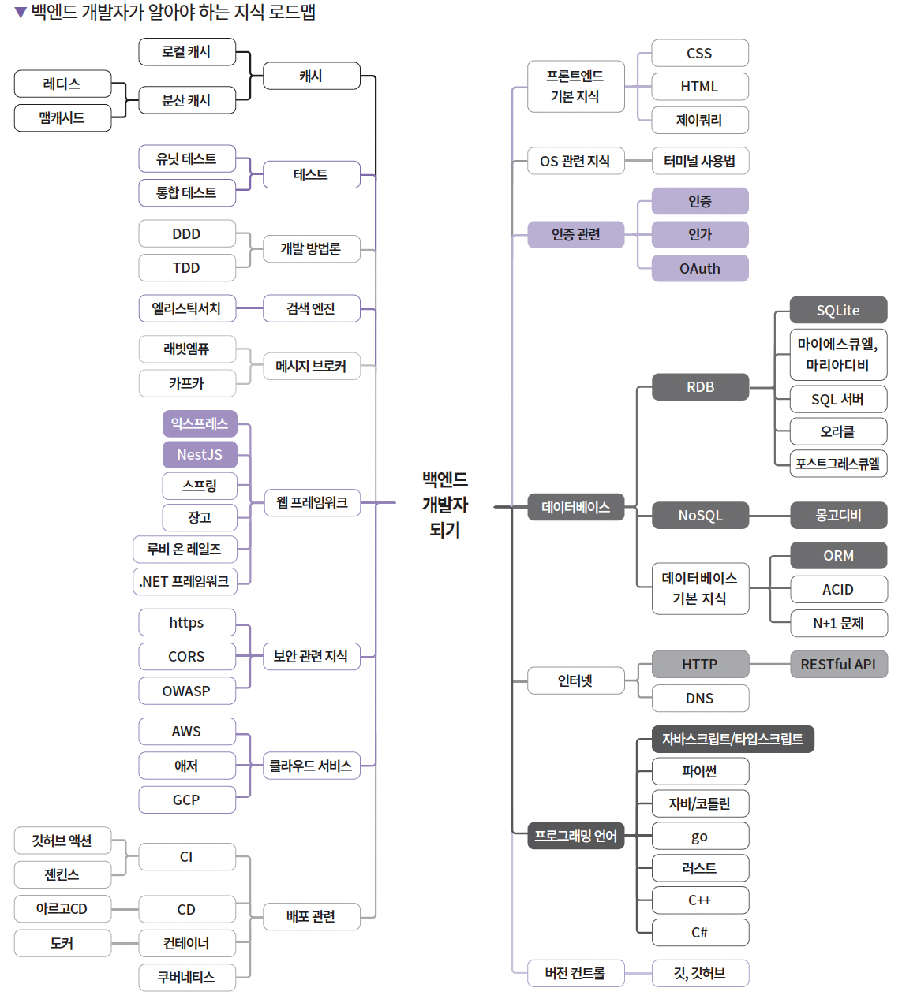
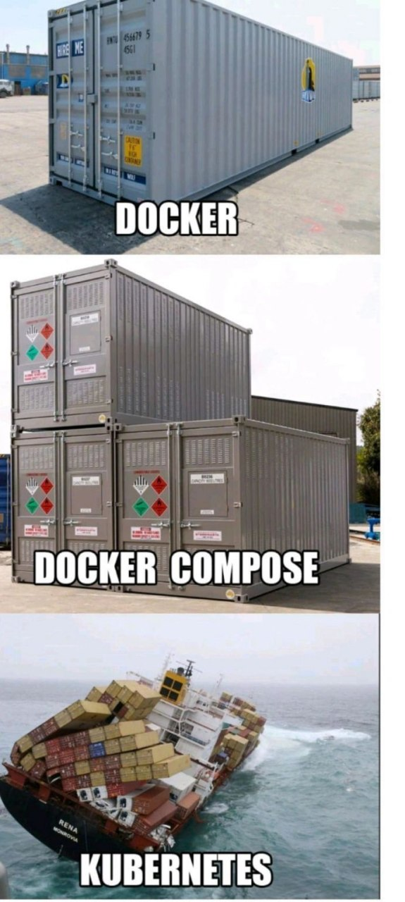
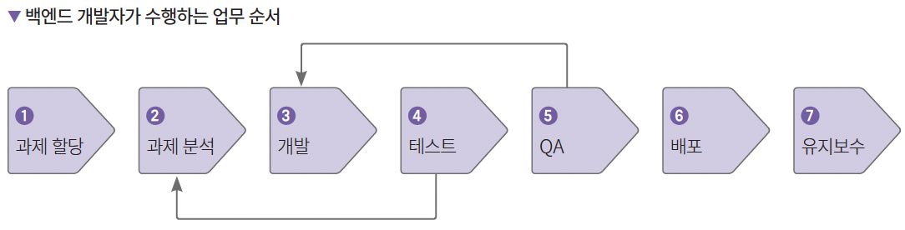

> 이 글은 요즘IT의 아티클 “누구도 알려주지 않은 백엔드 로드맵”을 참고하여,
> 제 언어로 재정리한 학습 노트입니다.
> 
> 원문 출처 : https://yozm.wishket.com/magazine/detail/2064/
> 
> 작성 목적 : 개인 학습 및 이해 정리
>

백엔드 개발자가 되려면 무엇을 알아야 할까?

백엔드 개발자는 프로그램이 구동되는 데 있어서 정확히 어디부터 어디까지의 일을 수행할까?

오늘 정리해 볼 것은 백엔드 개발자의 로드맵에 대한 이야기이다.

놀랍게도 여기 있는 모든 것이 백엔드 개발자가 가져야 할 역량이다!

그렇다면 왜 백엔드 개발자는 이러한 지식들을 가져야 하는 걸까?이걸 알기 위해서는 백엔드 개발자가 하는 일을 알아야 한다.

## 백엔드 개발자가 무슨 일을 하는데?

대강 알고 있겠지만, 프론트 개발자는 사용자가 직접 다루는 화면의 앞단을 관리하는 역할을 한다.

그렇다는 건 무엇인가? 그 뒤에서 일어나는 모든 일들은 백엔드 개발자가 관리하는 일이라는 것이다.

이제부터는 사용자가 프로그램을 사용하면서 일어나는 일을 순서대로 정의하여, 백엔드 개발자가 왜 이 모든 것들을 알아야만 하는지를 설명하겠다.

### 로그인

옷을 사고 싶어서 지그재그에 들어갔다. 지그재그에 들어가서 옷을 사기 전에 해야 할 첫 번째 일은 바로 로그인을 하는 것이다.

자, 그렇다면 앱은 어떻게 우리가 '우리'라는 것을 아는 걸까? 이 과정에서 사용되는 것이 바로 **인증과 인가**라는 개념이다.

**인증**은 우리가 우리임을 검증하는 것이고, **인가**는 검증된 사용자에게 역할을 부여해서 '정문'을 통과시켜주는 것이다.

이때 사용되는 가장 유명한 것이 바로 **JWT 토큰**이다. 인증된 사용자에게 정보를 담은 JWT 토큰을 발급하여, 정문을 통과할 키로 사용하는 것이다.

그렇다면 **OAuth**는 무엇인가? 인터넷 사용자들이 비밀번호를 제공하지 않고 서비스 제공업체에서 제한된 권한만을 제공하여 인가하는 방식을 말한다. 흔히 자주 사용하는 소셜 로그인이 여기에 해당한다.

### 네트워크 통신

자 이제 사용자는 앱에 접속했다!

그렇다면, 사용자가 화면단에서 내리는 명령들을 서버에서 어떻게 처리하여 앱 화면이 이동하도록 하는 걸까? 답은 바로 **"프로토콜"**이다.

프로토콜은 미리 정해둔 약속으로, 네트워크라는 큰 범주의 일부이다. 클라이언트에서 서버로 요청을 보낼 때도, 서버에서 클라이언트로 응답을 보낼 때도 **HTTP 프로토콜**을 사용하기 때문에 네트워크 통신에 대한 기본적인 지식은 필수이다.

이와 더불어 알아야 하는 것이 바로 **DNS**이다. 서버는 본디 자신만의 집 주소인 IP를 가지고 있는데 사용자 입장에서 이를 외우기는 굉장히 어렵다(숫자로 되어 있으니..). 그래서 사용자가 알기 쉬운 닉네임 같은 것을 붙여주는데, 이것을 바로 DNS 서버가 처리해주게 된다.

즉, 사용자가 도메인 네임으로 주소를 입력하면 DNS에서 IP로 변환하여 연결해주는 것이다.

### 웹 서버와 WAS

자, 사용자가 앱에서 내리는 명령은 다양하다. 이미지 요청을 할 수도 있고, 상품 구매를 위해 구매 요청을 할 수도 있다. 이미지를 요청할 경우 이미지 파일만 불러오면 되지만 구매를 위해 데이터를 보내야 할 경우 데이터 처리 작업이 추가로 필요하다.

이때, 이미지 처리와 같은 정적인 콘텐츠를 제공하는 역할을 하는 것이 **Nginx**와 같은 웹 서버이고, 동적인 웹 애플리케이션을 처리하는 데 사용되는 것이 바로 **WAS**이다. WAS에는 대표적으로 Tomcat과 JEUS 등이 있다.

WAS는 주로 **프레임워크**를 활용하는데, 프레임워크는 개발에 필요한 예외 처리, 데이터베이스 연결, 외부 라이브러리 연동 등의 기능을 추상화해서 코드 구조의 일관성을 지키는 데 도움을 준다.

우리가 잘 아는 Spring, Django, Node.js 등이 여기에 속한다.

### 24/7로 돌아가는 서버

보통 앱을 사용하면서 새벽에 앱을 켰다는 이유로 서버가 구동되지 않는다는 등의 경험은 한 적이 없을 것이다.

이는 서버가 장애 등의 특수 상황을 제외하고는 항시 꺼지지 않는 컴퓨터에서 돌아가기 때문이다.

~~서버는 불면증이다...~~

이때 사용하는 것이 바로 **리눅스**와 같은 컴퓨터 운영체제이다. 즉, 운영체제(OS)는 우리가 작성한 코드를 딛는 토지와 같다. 그러므로 이 토지를 단단하게 다져둬야 항시 안정적인 서비스 운영이 가능하다. 그래서 운영체제에 대한 지식은 필수이다.

대부분의 리눅스 운영체제는 **CLI**를 사용하기 때문에 기본적인 명령어를 익혀두는 것은 필수이다.

콘솔창에서 사용하는 에디터는 vim, emacs와 같은 것이 있는데 이들 중 하나도 익혀두는 것이 좋다.

### 배포

프레임워크로 코드 개발이 완료되었다면 이를 배포해야만 사용자가 사용하는 앱이 될 수 있다.

이때, **컨테이너 환경**(Docker, Podman)을 이용하면 개발과 실제 운영 서버의 환경을 동일하게 맞추어 테스트가 가능하다. 개발 환경을 하나의 선물상자 패키지처럼 묶어서 독립된 환경을 유지할 수 있기 때문이다.

컨테이너를 **단일 서버에 배포**할 때는 Docker만 사용해도 되지만, **여러 서버에 대규모로 배포**하고 자동으로 관리해야 할 때는 **Kubernetes**(쿠버네티스)를 사용한다. Kubernetes는 여러 컨테이너를 자동으로 배포, 확장, 관리해주는 오케스트레이션 도구이다.

쉽게 비유하자면, 컨테이너는 화물을 담은 박스, Docker는 박스를 만드는 도구, Kubernetes는 여러 박스를 여러 선박에 자동으로 싣고 관리하는 시스템과 같다. 여러 서버에 배포해서 관리할 때는 일일이 박스를 적재하는 것은 너무 많은 품을 들이기 때문에, 이를 적재하고 관리하는 도구를 함께 활용하는 것이다.

~~이만큼 좋은 비유가 있을까?~~

### CI/CD

보통 개발을 해봤다면 CI/CD라는 말을 들어봤을 것이다.

그렇다면 CI/CD가 무엇인가?

애자일 개발에서는 작은 단위를 지속적으로 배포하며 수정하는 과정을 거친다는 것을 잘 알고 있을 것이다.

이때 나오는 개념이 바로 CI/CD이다. **CI**(Continuous Integration, 지속적 통합)는 새로운 코드 변경 사항이 정기적으로 빌드 및 테스트되어 저장소에 통합되는 것을 말한다.

**CD**(Continuous Delivery/Deployment, 지속적 전달/배포)는 CI를 거친 코드가 실제 프로덕션 환경까지 자동으로 배포되는 것이다. 즉, CI가 "코드를 검증하고 통합하는 수정자"의 역할이라면 CD가 "검증된 코드를 실제 서비스에 전달하는 배포자"의 역할을 한다고 보면 된다.

CI/CD에 활용되는 도구 중 대표적인 것이 바로 **GitHub Actions**과 **Jenkins**이고(그래서 Jenkins 로고가 집사인가 봐!!!), CD에 특화된 도구로는 **ArgoCD**가 있다.

> 지금까지 백엔드 개발자가 알아야 할 기술 스택을 사용자의 여정에 따라 살펴보았다.
>
>
> 로그인부터 시작해서 네트워크 통신, 서버 처리, 배포, 그리고 CI/CD까지. 처음엔 막연해 보이지만, 이 모든 요소들이 하나의 퍼즐처럼 맞춰져서 하나의 완성된 서비스를 만들어낸다는 게 정말 매력적이라고 생각한다. 마치 하나하나 정성들인 재료들을 조합하여 하나의 음식을 만들어내는 궁중 요리사가 된 기분이랄까?
>
> 각각의 기술이 독립적으로 보이지만, 결국엔 모두 유기적으로 연결되어 사용자가 버튼 하나 누르는 그 순간을 완성시킨다. 이 모든 걸 배워나간다는 게 솔직히 두근거린다. 하나씩 익혀가면서 전체 그림이 보이는 그 순간이 정말 기대된다.
>