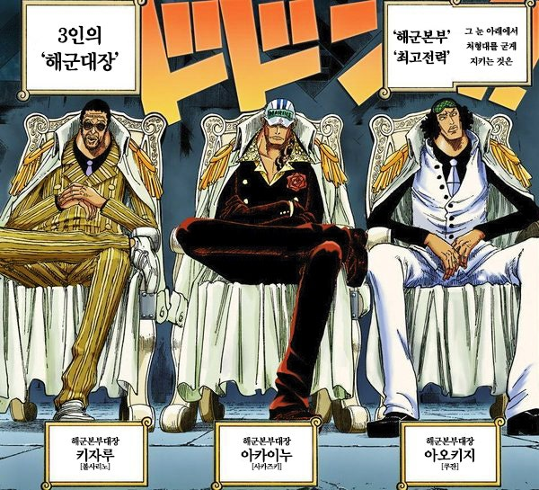
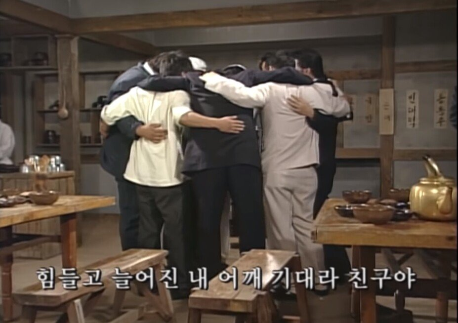
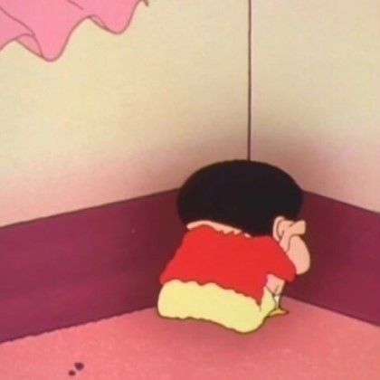
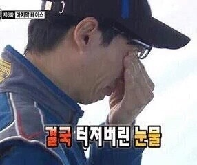
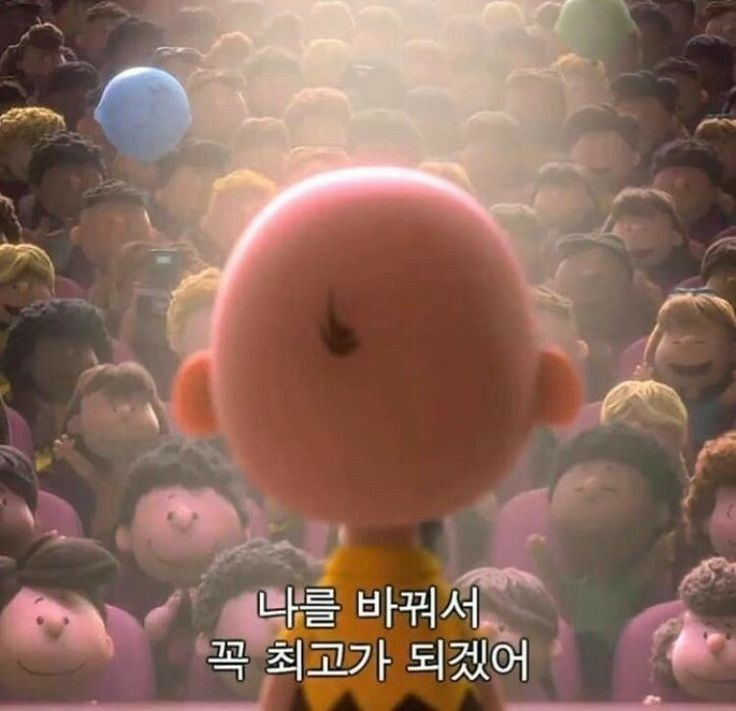

> 이 글은 요즘IT의 아티클 "우물 안 개구리를 벗어나는 개발자의 특징"을 참고하여,
> 제 언어로 재정리한 학습 노트입니다.
>
> 원문 출처 : https://yozm.wishket.com/magazine/detail/3369/
>
> 작성 목적 : 개인 학습 및 이해 정리
>

대 AI의 시대

진짜 개발자가 되려면 무엇을 알아야 할까?

나는 올바른 길로 가고 있는가?

오늘은 진짜 개발자가 되기 위해 갖춰야 할 태도에 대해서 알아본다.

## 역할을 벗어나야 한다.

어제 공부한 객체지향의 사실과 오해에서 중요한 개념으로 역할, 책임, 협력에 대해서 공부했었다.

물론 이건 개발자가 가져야할 태도와는 거리가 멀지만, 이 아티클에서는 개발자가 "역할"을 벗어나야 한다고 말한다.

왜 역할을 벗어나야 진짜 생각하는 개발자가 될 수 있을까?

### 갇힌 역할은 생각이 자라나는 것을 막는다.

역할이라는 것에는 직무 뿐 아니라 호칭(Title), 전문 분야(Domain)와 같이 '여기까지가 내 일' 이라고 경계를 긋는 사고 방식, 즉 심리적 경계선을 함께 포함한다.

즉, 백엔드 개발자로 예를 들자면 이렇다.

> "API를 짜는 일 외에 이 사업 전략에 대한 부분은 제가 신경쓸 부분이 아니지 않나요?"

이러한 마인드는 결국 사업 실패로 이어진다. 전형적인 "우물에 갇힌 개발자"의 마인드인 것이다.

### 닫힌 관점과 "왜?"의 실종이 만드는 우물안 개발자

이러한 마인드는 "왜?"의 실종을 만든다. 즉, 개발자를 역할이라는 울타리 안에 갇히게 만든다.

이때 놓친 질문들은 다음과 같다.

> 사업 관점 : 이 기능으로 회사가 얻으려는 진짜 가치는 무엇일까?
> 
> 고객 관점 : 고객이 이 기능을 사용할 때 어떤 경험을 할까? 이것이 정말 고객의 문제를 해결할까?
> 
> 마케팅 관점 : 이 기능은 나중에 어떻게 포장하고 알려야 매력적일까?
> 

이러한 질문을 놓친다면, 기술적으로 완벽하더라도 사업적으로 구멍이 생겨버린다.

이러한 결과물은 시장의 외면을 받는다.

## 역할 수행자는 AI에 의해 쉽게 대체된다.

역할 수행을 가장 잘 하는 사람은 누구일까? 바로 AI 에이전트이다.

> 요구사항에 맞춰 코드를 생성하고 테스트 케이스를 작성하는 개발 AI
> 
> 요구사항만 입력하면 웹 사이트 화면을 만들어주는 디자인 AI
> 
> 시장 데이터를 분석해 보고서를 작성하는 AI
> 

AI가 가장 잘 하는 일은 명확하게 정의된 규칙과 데이터를 기반으로 한 역할 수행이다.

## 강력한 무기, 주인의 관점을 가져라

이 역할이라는 울타리에 갇히지 않기 위해서 가장 중요한 것은 무엇일까? 바로 **주인의 관점** 을 가지는 것이다.
**만약 이 회사가 내 회사이고, 이 돈이 내 돈이라면, 나는 어떤 결정을 내릴 것인가?** 라는 질문을 스스로에게 던지는 태도이다. 

대장이 되어라!

## 관점을 열고 성장해라!

### 압도적인 학습 효율

관점을 여는 순간, 나의 시야가 넓어지고 학습 효율이 올라간다. 

예를 들어 **실패** 라는 하나의 사건을 두고 서로 다른 관점을 빌려 회고하는 것만으로도, 기술, 사업, 사용자 경험, 커뮤니케이션의 관점에서 동시 다발적인 학습을 이뤄낼 수 있다.

하나의 실패를 겪더라도 JOB을 가진 사람들마다 관점의 차이가 난다. 

> 개발자(나)의 관점과 기술 : 모바일 환경에서 로딩 속도가 느렸으니 최적화에 신경을 써야겠다.
> 
> 기획자의 관점과 사업 : 우리가 해결하려던 문제가 사용자 입장에서 진짜 '고통'이 아니었나봐,
> 
> 디자이너의 관점과 사용자 경험 : UI/UX가 직관적이지 못했나?
> 
> 마케터의 관점과 커뮤니케이션 : 홍보가 제대로 되지 않은 것 같아. 다음에는 공격적인 마케팅을 해야겠어
> 

### 차원이 다른 협업

모든 협업은 상대방의 관점을 이해하는 것에서 시작된다.

예를 들어, 디자이너가 어떠한 버튼에 애니메이션 효과를 넣기를 원한다고 생각해보자

보통의 대화라면 이 기능이 필요하다 vs 기술적으로 기한 안에 불가능하다와 같은 대화가 오가겠지만, 관점을 이해하는 측면에서 소통하면 다음과 같은 소통이 이어진다.

> 디자이너 : 이 버튼으로 고객에게 전달하고 싶은 핵심 경험은 '놀라움과 즐거움'이에요. 그걸 표현하기 위한 아이디어로 애니메이션 효과를 생각해봤어요
> 
> 개발자 : 아 목표가 '놀라움과 즐거움!'이군요! 애니메이션은 기한 안에 어렵지만 이 파티션 효과를 주면 유사한 경험이 가능할 것 같은데 어떠신가요?
>

이처럼 상대방의 목표(왜?)를 먼저 물어보는 관점 기반 소통은 핵심을 꿰뚫기 때문에 불필요한 감정 소모와 재작업 비용을 획기적으로 줄인다.

## 개인 회고

이 아티클을 보고 개인적으로 찔리는게 많았다. 결국 나 또한 역할 이라는 안락한 울타리 안에 스스로 틀어박혀 내가 가졌던 모든 질문점들을 외면했고,
결과적으로 실패라는 결과로 이어졌으니

이제부터는 짧게 내 얘기를 해볼까 한다.

### 처음 가졌던 왜 라는 질문

우리가 오굿페이에 대한 기획을 하고 있을 시점, 후불결제 서비스를 시도하기로 했을 때 가장 먼저 느꼈던 의문점이다.

국내에서 실패해서 다른 기업체들이 사업을 접었다면 **실패한 원인이 있지 않을까?** 

단순히 카드가 발전해서 실패한게 맞을까? 카드의 발전으로 실패한거라면, 우리가 카드에 비해 가지는 장점이 있어야 하는데

그게 **MZ 세대** 로 타겟을 잡는 것 하나만으로 괜찮을까? 

비즈니스적 의문이 없었던게 아니다. 이런거 할때는 신중한 편이라 당연히 의문이 있었는데....기획은 내 일이 아니라고 생각해서 애써 외면했던 것 같다.

### 사행성에 대한 질문

기획 단계에서는 사실 타겟층을 한정해두는 것으로 어느정도의 명분은 된다고 생각했다. 부족한 부분이야 발표할때 살을 붙이면 되는 부분이니까

그런데 내가 가졌던 가장 큰 에러 사항은 여기에 쇼츠를 붙이자는 얘기가 나왔을 때 부터였다.

MZ세대를 대상으로 후불결제 서비스를 진행한다. 여기서부터 미성년자를 대상으로 하는 결제 서비스이니 윤리적 측면에서 벗어나기 어렵다.

그런데 여기에 최근 사회적으로 중독 문제가 대두되고 있는 쇼츠를 붙인다면

**여기서 날아오는 윤리적 책임에 대한 질문들에 대한 답**은 어떻게 해야 할 것인가?

이 부분 때문에 사실 나는 계속해서 반대를 했다.

쇼츠를 붙였을때 오는 다음과 같은 반작용 사항들을 걱정하고 있었기 때문이다.

> 1. 사행성 문제가 있을 수 있는 서비스에 중독 문제가 있을 수 있는 서비스의 조화
>
> 2. 쇼츠라는 것이 주는 가벼운 이미지가 결제 서비스에 미치는 악영향, 
> 
> 3. 2번의 이유로 인해 나라면 절대 쇼츠가 붙어 있는 서비스를 이용하지 않을 것 같아서
> 

내 의견이 묵살 당할 것을 알고 있으면서도 이건 계속 목소리를 냈던것 같다.

정말 진심으로 이 서비스가 걱정되었기 때문이다

강사님까지 쇼츠를 같이 붙이는게 괜찮다고 두둔하시면서 결국 내 의견은 완전히 묵살되었고

나는 이 때부터 이 서비스에 대한 모든걸 놨던 것 같다....

그래서 다른 팀 친구가 여기 쇼츠가 왜 있고 이게 하는 일이 무엇인지를 물었을때 대답하지 못했다.

**나도 그 이유를 모르니까.....정말로**

### 개발에 집중

그래서 더 개발에 집중 했던 것 같다.

사실, 여기 이 프로젝트에서 내가 얻어갈 수 있는 부분은 개발 경험 뿐이라고 스스로 생각 했던 것 같다.

내가 냈던 모든 의문들도 이유 없이 묵살되었고

더 이상 무슨 질문을 던지는게 의미 없다고 생각했어서

그냥 내 역할 이라는 울타리 안에 스스로를 가둬버렸다.

어쩌면 여기서부터 우리 서비스는 실패할 수 밖에 없었던게 아닌가 하는 생각이 든다.

### 흔들림

결국 우리 서비스는 근본적인 부분에서 흔들렸다.

마지막 발표 시연을 할 때 

외부 발표 강사님이 보시기에 우리 서비스에 코어가 빠져있다고 생각하셨던 것 같다.

결국 우려했던 부분이 터진건데,

거기서 내가 우리 서비스의 윤리적 측면에 대한..초반 고민점을 말씀 드리고 이거에 대한 답을 찾아야 할까를 여쭤보았을때,

당연히 그게 맞다..고 하셨다.

그때 아차 싶었다.

내가 결국 울타리에 갇혀서 모든걸 외면하는 동안

우리 서비스는 정말로 산을 향해 가고 있었구나 하는

### 후회

내가 끝까지 의견을 강하게 가져가야 했을까?

아무도 의문을 표하지 않았기 때문에 

우리 서비스가 실패한게 아닐까?

내가 협업 우호성이 지나치게 높은게 내 발목을 잡았나

나는 이미 후반에 참고 참다가 발표에 대한 의문을 제기했을때 싸웠는데

그냥 싸울 각오로 이 서비스를 위해 무언가 해야 했을까....

### 회고

이 모든 것은 이미 지나간 일이고

결과적으로 발표로 우리 서비스의 허점들을 덮지도 못했고

오히려 발표로 허점이 드러나버리는 상태가 되어 버렸기 때문에

**우리 서비스는 실패했다.**

6명이 만들어서 결국 4등 아니면 꼴지 라면

결국 우리가 꼴지인거라고 나는 생각한다

나는 완벽하게 실패했다....그냥 대실패했다.

이 아티클을 보고, 내 경험을 빗대어 봤을때 내가 느끼는 점은 그것이다.

> 싸움을 각오하되, 관점을 이해하는 면에서 최대한 많은 소통을 해서 역할의 울타리 면에서 벗어나야 한다.
> 
> 그것이 비록 상대방이 자신의 역할로 넘어오는 것에 대해 불편함을 느낄지라도
> 

어쩌면 실패했기 때문에 내가 한층 더 성장할 수 있었던 것이라고 생각한다.

실패는 너무 아프다. 다들 무엇인가 얻어가는 와중에 나만 빈손으로 돌아갔을때,

나름 열심히 했는데도 빈손으로 돌아가는 그 기분은 솔직히 상당히 참담하고 아직도 슬프다.

그래도 그거보다 더큰 값진 인사이트를 얻은 것이라고 나는, 생각한다.

**이제 우물안 개발자에서 벗어나서 우물 밖으로 가자.**

